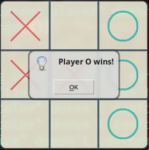

# 🎮 Tic-Tac-Toe GUI Game

A simple yet colorful **Tic-Tac-Toe** game implemented in Python using the Tkinter library. Play against a friend, test your X's and O's skills, and enjoy the nostalgic feel of this classic game in a modern graphical interface.

> Why did the X break up with the O?  
> _Because it felt "crossed" too often!_ 😄

---

## 📸 Features

- **Interactive Gameplay**: Click to mark your X or O and enjoy real-time updates.
- **Dynamic Color Theme**: Stylish color coding for X’s and O’s to make the game visually appealing.
- **Winner Detection**: Alerts the winner as soon as three in a row are aligned.
- **Draw Detection**: Declares a draw when the board is full without a winner.
- **Automatic Reset**: Restarts the game after each round.

---

## 🛠️ Technologies Used

- **Python** 🐍
- **Tkinter**: For the graphical user interface (GUI).

---

## 📋 Usage

### 1️⃣ Clone or Download

Download or clone the repository:

```bash
git clone https://github.com/Janardan-pathak/Tic-Tac-Toe.git
cd Tic-Tac-Toe/bin
```

### 2️⃣ Run the Game

Ensure you have Python installed, then run:

```bash
python tic_tac_toe.py
```

### 3️⃣ Play!

- Click on the grid to place your mark (X or O).
- The game alternates between Player X and Player O.
- A winner or draw is declared automatically, and the game resets.

---

## 📸 Screenshots

### Initial Board


### Gameplay




---

## 💡 Future Improvements

- Add support for single-player mode with AI.
- Track scores for multiple rounds.
- Introduce customizable themes and grid sizes.

---

**Now go ahead and cross off some fun! 🌀**
